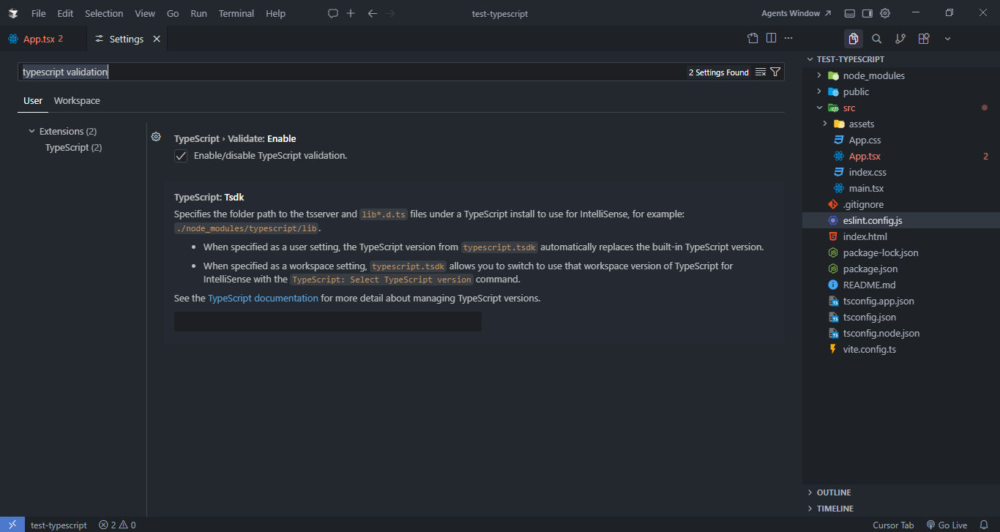

## 📚 Table of Contents

1. [📄 Documents](#-documents)
2. [📦 Packages List](#-packages-list)
3. [🌀 Create Your First Vite Project](#-create-your-first-vite-project)
4. [✨ Setup Prettier](#-setup-prettier)
5. [⚠️ Tailwind Class Sorting Not Working?](#%EF%B8%8F-tailwind-class-sorting-not-working)
6. [🟦 Show TypeScript red squiggles in the editor](#-show-typescript-red-squiggles-in-the-editor)

---

## 📄 Documents

### prettier

- [prettier install](https://prettier.io/docs/install)
- [prettier options](https://prettier.io/docs/options)

### Tailwind CSS

- [Tailwind CSS Installation Using-Vite](https://tailwindcss.com/docs/installation/using-vite)
- [Automatic Class Sorting with Prettier](https://tailwindcss.com/blog/automatic-class-sorting-with-prettier)

---

## 📦 Packages List

1.  [Prettier Plugin: Organize Imports](https://www.npmjs.com/package/prettier-plugin-organize-imports)

To organize imports automatically, install this plugin:

```js
npm install --save-dev prettier-plugin-organize-imports

```

2.  [react-feather](https://github.com/feathericons/react-feather)
    - Reference: lws 5.6 React Lazy Load explained
3.  [remarkable](https://www.npmjs.com/package/remarkable)
    - Reference: [Lazy-loading components with Suspense](https://react.dev/reference/react/lazy#suspense-for-code-splitting)

---

## 🌀 Create Your First Vite Project

- [npm create vite@latest](https://vite.dev/guide/#scaffolding-your-first-vite-project)

---

## ✨ Setup Prettier

The `prettier` npm package you installed only works from the terminal (e.g., `npx prettier --write .`). It does **not** make the editor format on save by itself. For that, you need two things:

1.  Install the Prettier extension in Cursor/VS Code
2.  Enable "Format on Save"

To set up Prettier so that it automatically formats your code every time you save, you need to configure both your project and your editor.

### 🛠️ Step 1: Install the Prettier Extension in your Editor

For your editor to know how to format on save, it needs the Prettier extension.

- Open the Extensions panel (`Ctrl+Shift+X` or `Cmd+Shift+X`).
- Search for **Prettier - Code formatter** (by Esben Petersen) and install it.

### 📦 Step 2: Install Prettier in your Project

It's best practice to install Prettier locally in your project so everyone working on it uses the same version. Run this in your terminal:

```bash
npm install --save-dev prettier
```

### ⚙️ Step 3: Create a Prettier Config File

Create a file named `.prettierrc` in the root of your project. This tells Prettier what rules to follow. Here is a common example:

```json
{
    "tabWidth": 4,
    "trailingComma": "es5",
    "semi": true,
    "singleQuote": false
}
```

### 💻 Step 4: Configure the Editor to "Format on Save"

You need to tell Cursor/VS Code to use Prettier as the default formatter and to trigger it when you save.

#### 📁 Option A: Project-specific settings (Recommended)

This ensures anyone who opens this project gets the same format-on-save behavior.

1. Create a folder named `.vscode` in your project root.
2. Inside it, create a file named `settings.json`.
3. Add the following configuration:

`.vscode/settings.json`

```json
{
    "editor.defaultFormatter": "esbenp.prettier-vscode",
    "editor.formatOnSave": true
}
```

#### 🌍 Option B: Global settings

If you want this to apply to **all** projects you open on your computer:

1. Open Settings (`Ctrl+,` or `Cmd+,`).
2. Search for **"Format On Save"** and check the box.
3. Search for **"Default Formatter"** and select **Prettier - Code formatter** from the dropdown.

### 🚫 Step 5: (Optional) Add a `.prettierignore` file

You usually don't want Prettier to format build outputs or package folders. Create a `.prettierignore` file in your project root:

```text
node_modules
dist
build
coverage
```

### 📜 Step 6: (Optional) Add a format script

Update your `package.json` to include a format script:

```json
{
    "scripts": {
        "format": "prettier --write ."
    }
}
```

Running `npm run format` will:

- 🔍 Scan your entire project
- 📄 Find all supported files (`.js`, `.ts`, `.jsx`, `.tsx`, `.json`, `.css`, `.md`, etc.)
- ✨ Format them automatically based on your `.prettierrc`
- 💾 Save the changes directly

---

### 📊 Prettier Setup Summary

| Piece                          | What it does                            |
| ------------------------------ | --------------------------------------- |
| 📦 `prettier` npm package      | Lets you run Prettier from the terminal |
| ⚙️ `.prettierrc`               | Defines your formatting rules           |
| 🔌 Prettier VS Code extension  | Runs Prettier inside the editor         |
| 💾 `editor.formatOnSave: true` | Automatically formats files on save     |

> ⚠️ **Note:** All four pieces must be configured for format-on-save to work properly.

---

### 🧠 How it works

When you press `Ctrl + S` (or `Cmd + S`):

1. ⌨️ VS Code triggers the formatter
2. 🪄 Prettier formats the file
3. ✅ File auto-updates instantly

---

### 🤝 What to push vs ignore from `.vscode`

Push **workspace settings** that help the whole team:

```text
.vscode/settings.json
```

This ensures:

- Everyone uses Prettier
- Consistent formatting across the team

Add this to your `.gitignore`:

```text
.vscode/*
!.vscode/settings.json
!.vscode/extensions.json
```

---

## ⚠️ Tailwind Class Sorting Not Working?

If Tailwind classes are not being sorted automatically, the problem is usually the order of your Prettier plugins.

`prettier-plugin-tailwindcss` must be **last** in the `plugins` array.

```jsonc
{
    // ❌ Wrong
    "plugins": ["prettier-plugin-tailwindcss", "prettier-plugin-organize-imports"],
}
```

```jsonc
{
    // ✅ Correct
    "plugins": ["prettier-plugin-organize-imports", "prettier-plugin-tailwindcss"],
}
```

Why? Tailwind sorts classes during the final formatting step. If another Prettier plugin runs after it, Tailwind's output gets overridden.

---

## 🟦 Show TypeScript red squiggles in the editor

If TypeScript errors are not showing as red squiggles in Cursor/VS Code, make sure the built-in TypeScript validation is enabled. These squiggles come from the TypeScript language service, not ESLint.

To enable it from Settings:

1. Open Settings: `Ctrl + ,`
2. Search for `typescript validate`
3. Enable `TypeScript > Validate: Enable`



In `settings.json`, this setting should be missing or set to `true`:

```json
{
    "typescript.validate.enable": true
}
```

If you also want JavaScript files to show validation errors, enable this too:

```json
{
    "javascript.validate.enable": true
}
```

After changing the setting, restart the TypeScript server:

```bash
Ctrl + Shift + P → TypeScript: Restart TS Server
```

Then reopen the file or editor if needed. Type errors should now show as red squiggles in the editor.

Remember: ESLint and TypeScript validation are different. ESLint checks linting rules, while TypeScript validation checks type errors.

### 🧩 TypeScript: Restart TS Server Command Is Missing or Don't find `typescript validate` in settings

If the `TypeScript: Restart TS Server` command does not appear, the built-in TypeScript extension may be disabled.

To fix it:

1. Open the Extensions view (`Ctrl+Shift+X`).
2. Search for `@builtin typescript`.
3. Find **TypeScript and JavaScript Language Features**.
4. If it is disabled, click **Enable**.
5. If it is already enabled, disable it and enable it again to reset the extension.
